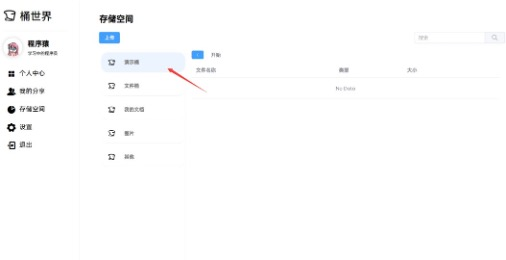
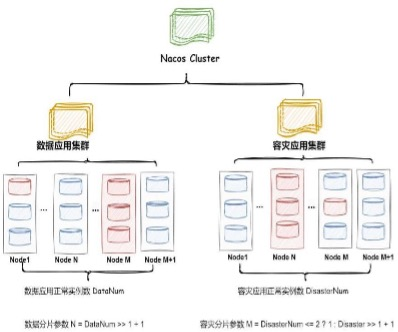

# 桶世界 面向多场景应用的对象存储平台

* [桶世界 面向多场景应用的对象存储平台](#桶世界-面向多场景应用的对象存储平台)
  * [第一章 需求分析](#第一章-需求分析)
    * [1. 作品简介](#1-作品简介)
    * [2.背景及研发意义](#2背景及研发意义)
    * [3.功能需求](#3功能需求)
      * [业务服务子系统](#业务服务子系统)
      * [数据服务子系统](#数据服务子系统)
    * [性能需求](#性能需求)
    * [界面需求](#界面需求)
    * [接口需求](#接口需求)
      * [硬件接口](#硬件接口)
      * [软件接口](#软件接口)
    * [其他需求](#其他需求)
      * [泄密保护](#泄密保护)
      * [用户信息验证](#用户信息验证)
      * [可移植性](#可移植性)
      * [可维护性](#可维护性)
      * [数据库的可恢复性](#数据库的可恢复性)
      * [完善的日志系统](#完善的日志系统)
    * [竞品分析](#竞品分析)
    * [创新点综述](#创新点综述)
  * [第二章 概要设计](#第二章-概要设计)
    * [功能模块设计](#功能模块设计)
      * [业务服务子系统](#业务服务子系统-1)
        * [权限校验模块](#权限校验模块)
        * [增添权限模块](#增添权限模块)
        * [删除权限模块](#删除权限模块)
        * [添加源数据模块](#添加源数据模块)
        * [删除源数据模块](#删除源数据模块)
      * [数据服务子系统](#数据服务子系统-1)
        * [上传模块](#上传模块)
        * [分块模块](#分块模块)
        * [下载模块](#下载模块)
        * [合并模块](#合并模块)
        * [调整分块算法模块](#调整分块算法模块)
    * [模块的层次结构](#模块的层次结构)
        * [业务服务子系统各层次结构](#业务服务子系统各层次结构)
        * [数据服务子系统各层次结构](#数据服务子系统各层次结构)
  * [模块间接口](#模块间接口)
  * [第三章 详细设计](#第三章-详细设计)
    * [架构设计](#架构设计)
      * [架构设计解决的痛点：](#架构设计解决的痛点)
    * [数据库设计](#数据库设计)
      * [E-R图](#e-r图)
    * [字段设计和索引设计](#字段设计和索引设计)
  * [界面设计](#界面设计)
    * [主界面](#主界面)
    * [分享群组](#分享群组)
    * [分享群组内文件](#分享群组内文件)
    * [查看桶文件](#查看桶文件)
    * [在线浏览文件](#在线浏览文件)
    * [文件上传](#文件上传)
  * [关键算法](#关键算法)
    * [分块算法](#分块算法)
      * [正常情况：](#正常情况)
      * [节点故障情况：](#节点故障情况)
    * [合并算法](#合并算法)
      * [正常情况：](#正常情况-1)
      * [节点故障情况：](#节点故障情况-1)
    * [调整分块算法](#调整分块算法)
  * [测试过程](#测试过程)
      * [接口测试](#接口测试)
      * [功能测试](#功能测试)
      * [性能测试](#性能测试)
      * [安全性测试](#安全性测试)
      * [兼容性测试](#兼容性测试)
  * [测试结果](#测试结果)
  * [测试后修正](#测试后修正)
* [第五章 安装及使用](#第五章-安装及使用)
  * [环境要求](#环境要求)
  * [服务启动过程](#服务启动过程)
      * [运行中间件](#运行中间件)
      * [运行网关 getway项目](#运行网关-getway项目)
      * [运行 Express项目：](#运行-express项目)
      * [运行 SpringBoot项目：](#运行-springboot项目)
      * [运行 Gin项目：](#运行-gin项目)
* [第六章 项目总结](#第六章-项目总结)
  * [升级演进](#升级演进)
  * [克服困难和水平提升](#克服困难和水平提升)
* [参考文献](#参考文献)

## 第一章 需求分析

### 1. 作品简介

桶世界是一款面向多场景的分布式对象存储平台，具有对象桶的增删改查、数据备份和归档、对象压缩、去重校验和断点续传、对象的分块存储和合并等功能。桶世界采用分布式架构，同时提供多重安全保障，确保用户数据的安全性和隐私保护。

### 2.背景及研发意义

随着云计算技术的快速发展，越来越多的企业和个人用户选择将数据存储在云端， 以达到更高的可靠性、更大的存储空间、更低的成本等优势。然而，传统的存储方式，如本地硬盘存储、磁带存储等，存在着成本高、容量限制、可靠性低等问题。因此，需要开发一种高效、安全、可靠、易用的云端数据存储解决方案，以满足用户的需求。

### 3.功能需求

#### 业务服务子系统

| **功能模块** | **功能** | **功能描述** |
| --- | --- | --- |
| 权限校验模块 | 权限校验及缓存 | 接受用户请求，缓存或查询数据库用户权限并根据条件缓存用户权限 |
| 增添权限模块 | 权限添加 | 对权限进行验证并为该用户增添权限 |
| 删除权限模块 | 权限删除 | 删除权限记录，并对布隆过滤器以及缓存更新 |
| 添加源数据模块 | 保存源数据 | 网关对请求 token进行校验并保存文件及持久化源数据记录 |
| 删除源数据模块 | 删除源数据 | 网关对携带 token进行校验，通过并删除源文件 |

表 1-1业务服务子系统

#### 数据服务子系统

表 1-2数据服务子系统

| **功能模块** | **功能** | **功能描述**                          |
|----------|--------|-----------------------------------|
| 上传模块     | 上传文件   | 系统将文件暂存系统内，待保存成功调用分块模块            |
| 分块模块     | 文件分块   | 对文件进行分块，并且可以还原                    |
| 下载模块     | 文件下载   | 将全部分块下载完成后合并形成完整文件                |
| 合并模块     | 文件分块合并 | 对多个文件分块进行合并                       |
| 调整分块算法模块 | 自动调整分块 | 使用分块参数，自动调整分块参数，使得文件保存更加均匀分散和高可用性 |

### 性能需求

我们的设计尽可能考虑人机交互的基本交互逻辑，设定一个统一的完善的交互逻辑，能够适应不同年龄段的用户操作，如下是基本性能需求。

登录：\<100ms

文件上传响应时间：\<1000ms文件下载响应时间：\<1000ms界面打开时间：\<100ms

### 界面需求

界面跳转不卡顿，各个界面功能完整，满足用户需求。

### 接口需求

#### 硬件接口

无。

#### 软件接口

      1. 获取桶内部接口：实现获取桶内部数据，完成数据交互；
      2. 添加新的源数据接口：实现添加新的数据源；
      3. 获取指定文件路径的权限接口：实现获取指定文件路径的权限；
      4. 接受文件分块：实现文件分块功能，对文件进行分块；
      5. 下载文件：实现文件的下载，完成用户的请求。

### 其他需求

#### 泄密保护

通过剪切板控制、拖拽、拷屏/截屏控制、和内存窃取控制等技术，防止泄漏用户数据。

#### 用户信息验证

用户登录、注册时会对用户的身份进行检查，不同人员的使用权限不同。

#### 可移植性

项目采用模块化设计思想，各个模块依靠接口进行数据交换，因此可以在一定程度上支持模块的移植。

#### 可维护性

#### 数据库的可恢复性

需要定期为数据库进行备份，定时将数据库文件数据备份到另一台服务器。

#### 完善的日志系统

项目应建立实时记录应用的运行日志，建立完备的日志系统，方便日后发现在开发时未考虑到的问题。

### 竞品分析

对比市面上其他相关平台的分析结果如表 1-3所示。

表 1-3竞品分析表

| **名称** | **公司** | **主要特点** | **可扩展性** | **数据保护** | **用户体验** |
| -- |--------| --- | --- | --- | --- |
|阿里对象存储OSS | 阿里巴巴   |高可用、高扩展、安全可靠 |有较强的 API支持，可根据业务需要进行容量和性能的灵活扩展 | 使用多副本冗余技术、访问控制策略等，提供云上数据保护；同时支持 HTTPS传输加密 |界面简单易用，同时有一定的可定制性。 |
|腾讯对象存储 COS | 腾讯云    |操作简便、接口丰富、高并发写入 |可自由选择存储桶的地域、可扩展容量，灵活扩展性强 | 采用跨区域复制等多种方式保障客户备份，同时配置项目级别的访问密钥 |用户体验简单直接，尤其适合对于云存储初次使用者。 |
|桶世界 | 南昌航空大学 | 面向多场景的分布式对象存储平台，具有数据备份和归档、对象压缩、去重校验和断点续传、对象存储的分块和合并等功能。 | 采用分布式架构，可支持横向扩 展，可根据实际业务需求动态扩展存储能力。 |提供了多重安全保障，包括数据加密、权限控制等措施。 |提供了可视化的管理控制台，方便用户进行管理和操作。 |

### 创新点综述

目前对象存储存在着诸多的问题，主要包括数据传输过程中存在丢失，容灾能力差，常规平台存储容量有限，无拓展性，数据处理能力有限，并发性差等问题。

桶世界解决了对象存储系统面临的挑战，具有多项创新点，在满足用户数据存储基本需求的同时达到如下功能。

1. 数据容灾和归档：实现了高可用的容灾备份功能，引入 ErasureCode编码容错技术，在

空间允许的状态下大幅提高数据的可用性和抗风险能力，确保数据的安全性和可靠性，同时可以减少数据存储的成本；

1. 对象分块存储和合并：提高数据的读写性能，同时支持大文件的上传和下载；
2. 高可用性、可扩展性：采用分布式架构，支持动态扩容，根据实际需求灵活调整存储空间和带宽，支持多种协议数据传输，以满足不同使用场景的需求；
3. 多重安全保障：包括访问控制、数据加密等技术，确保用户数据的安全性和隐私保护。

## 第二章 概要设计

### 功能模块设计

#### 业务服务子系统

##### 权限校验模块

用户发送请求于该模块，该模块通过缓存或者数据库查询用户的权限，并且对缓存中不存在的用户权限进行缓存，减小下一次查询的查询压力。

##### 增添权限模块

用户发送需要增添的权限，模块对权限进行验证，确定该用户为增添权限桶的 root用户时才继续后续增添权限的请求。

##### 删除权限模块

用户发送请求删除权限记录，并对布隆过滤器以及缓存进行更新。

##### 添加源数据模块

用户发送请求添加源数据，网关对其携带的 token 进行校验，完成初始的鉴权后推送给后续服务处理，保存文件，持久化源数据记录。

##### 删除源数据模块

用户发送请求添加源数据，网关对其携带的 token 进行校验，删除当前源数据与源文件的指向，若当前源文件指向数为 0 则删除该源文件。

#### 数据服务子系统

数据服务子系统用于实现文件管理和节点管理，包括如下功能。文件管理：实现文件的上传，下载和查询。

节点管理：实现分块算法的自动调整，文件分块的发送和校验。
##### 上传模块

用户调用此模块上传一个或多个文件至本系统，该模块会将文件暂存系统内，待完全保存成功后调用分块模块，将文件进行分块。分块完成后，通过 RPC调用其他应用实例发送文件分块，达到文件的均匀存储。

##### 分块模块

该模块可以将文件进行分块。该模块引入纠删码的 RS算法，将原数据分成 N块后，同时在可以接受冗余的空间范围内添加一部分数据得到 N+M块数据，使得当数据丢失量小于 N 块时可以根据剩余的数据迅速合并还原原数据。

##### 下载模块

用户调用此模块从系统中下载文件，该模块会读取所有的文件分块路径和分块所存在的实例，模块通过远程调用获取从其他实例中下载文件分块。客户端通过多线程下载的方式下载所有的文件分块，全部分块下载完成后进行合并。

##### 合并模块

该模块可以将多个文件分块进行合并。该模块引入纠删码的 RS算法，将原数据分成N块后，同时在接受冗余的空间范围内添加一部分数据得到 N+M块数据，使得当数据丢失量小于N 块时可以根据剩余的数据迅速合并还原原数据。

##### 调整分块算法模块

在文件管理模块中需要使用到文件分块参数，分块参数的自动调整由该模块实现。其核心思想是：先获取当前系统内所有数据应用和容灾应用的正常运行实例的数量，根据实例的数量动态调整分块的参数，保持文件的均匀分散和高可用性。

### 模块的层次结构

##### 业务服务子系统各层次结构

业务服务子系统主要分成三层，分别是数据服务，包括认证服务，元数据服务，桶服务，各种服务之下对应着不同类型的具体功能，如图 2-1 所示。

图 2-1业务服务子系统结构

##### 数据服务子系统各层次结构

数据服务子系统主要包括文件管理和节点管理，文件管理主要包括文件上传、查询和下载，节点管理包括调整分块算法，发送文件分块和文件校验，具体结构如图 2-2 所示。

图 2-2数据服务子系统结构

## 模块间接口
**查询所有桶** 请求方式：GET

请求URL：/buckets/list/{accountId}

路径参数：用户 ID（accountId）

响应：状态（status），消息（message）和数据（data）字段。

- status：表示请求的处理状态，可能的值包括成功（"success"）和错误（"error"）。
- Message：与请求处理状态相关的信息。
- data： 查询到的用户桶的列表。每个桶对象包含桶 ID（bucketId）， 桶名称

（bucketName），以及所属用户的 ID（accountId）。

**根据用户**  **id**** 查询桶内所有文件**请求方式：GET

请求URL：/buckets/all/{accountId}

路径参数：用户 ID（accountId）

响应：状态（status），消息（message）和数据（data）字段。

- status：表示请求的处理状态，可能的值包括成功（"success"）和错误（"error"）。
- Message：与请求处理状态相关的信息。
- data：文件类型和文件统计数据的映射。键（key）是文件类型（如 fileType1、fileType2）。值（value）是文件类型的统计数据对象，包含文件数量（num）和总大小（totalSize）。

**根据桶**  **id**** 查询桶内所有文件**请求方式：GET

请求URL： /buckets/list/{bucketId}

路径参数：桶 ID（bucketId）。

响应：状态（status），消息（message）和数据（data）字段。

- status：表示请求的处理状态，可能的值包括成功（"success"）和错误（"error"）。
- Message：与请求处理状态相关的信息。
- data：查询到的桶内文件的列表。每个文件对象文件 ID（documentId），文件名

（documentName），文件大小（size），文件类型（type），以及上传时间（uploadedAt）等信息。

**上传文件** 请求方式：POST请求URL：/upload

请求参数：文件（file）和桶 ID（bucketId）。

响应：状态（status），消息（message）和数据（data）字段。

- status：表示请求的处理状态，可能的值包括成功（"success"）和错误（"error"）。
- message：与请求处理状态相关的信息。
- data：表示上传文件的结果信息。

 **下载文件** 请求方式：POST

请求URL：/download

请求参数：文件 ID（documentId）。

响应：直接返回文件内容，以下载方式进行处理。

- consumes：设置为 MediaType.ALL\_VALUE，表示支持接受任何类型的数据。

 **分页查询小组信息** 请求方式：GET

请求URL：/organization/page

请求参数：页码（page）、页大小（pageSize）、用户 ID（id）和小组名称（name，可选）

响应：状态（status），消息（message）和数据（data）字段。

- status：表示请求的处理状态，可能的值包括成功（"success"）和错误（"error"）。
- message：包含与请求处理状态相关的信息。
- data：包含分页查询到的小组信息。
- current：当前页码。
- pageSize：页大小。
- total：总记录数。
- pages：总页数。
- records： 小组列表。每个小组对象包含小组 ID（organizationId）、小组名称

（organizationName）、创建人信息（createdAccount）和成员信息列表

（memberAccounts）。

- createdAccount：创建人信息，包含账户 ID（accountId）、账户名称（accountName）和账户邮箱（accountEmail）。
- memberAccounts：成员信息列表，包含账户 ID（accountId）、账户名称（accountName）和账户邮箱（accountEmail）。

**查询用户所在小组信息** 请求方式：GET

请求URL：/organizations/list/{id}

请求参数：用户 ID（id）。

响应：包含状态（status），消息（message）和数据（data）字段。

- message：包含与请求处理状态相关的信息。
- data：包含用户所在的所有小组信息。
- organizationId：小组 ID。
- organizationName：小组名称。

## 第三章 详细设计

### 架构设计

本系统架构主要分成五个部分，分别是客户端，网关层，服务层，存储层，持续集成五个部分，各部分之间存在交互，最终组成整个系统，具体设计如图 3-1 所示。

图3-1 系统架构设计

系统主要支持对象桶操作，用户管理，数据备份和数据归档，数据二次应用，对象数据压缩，数据校验、去重和断点续传等功能，根据系统功能，设计系统部署方案，如图 3-2所示。

图3-2 系统部署

#### 架构设计解决的痛点：

    1. 提高平台容灾能力；
    2. 使得平台拥有处理一定高并发的能力；
    3. 分布式的架构，使得平台易于拓展；
    4. 平台具有伸缩性，处理能力随硬件提高而提高。

采用目前的架构设计解决了如上存在的痛点并给系统带来了如上的提升，如图 3-3是针对痛点的解决方案。

图3-3 解决方案

### 数据库设计

本系统数据库设计设计均满足三范式。

#### E-R图

根据本系统的设计需求，得到数据库设计 E-R图，如图 3-4所示。

图 3-4系统E-R图

### 字段设计和索引设计

根据数据库设计，具体的表结构如表 3-1至 3-5所示。

表 3-1account用户表

| **字段**       | **类型**       | **主键** | **非空** | **默认值** | **注释** |
|--------------|--------------|--------|--------|---------|--------|
| id           | bigint       | √      | √      |         | 主键     |
| name         | varchar(255) |        |        | ''      | 昵称     |
| username     | varchar(255) |        |        | ''      | 用户名    |
| password     | varchar(255) |        |        | ''      | 密码     |
| photo        | varchar(255) |        |        | ''      | 头像     |
| motto        | varchar(255) |        |        | ''      | 个人格言   |
| create\_time | datetime     |        |        |         | 创建时间   |
| update\_time | datetime     |        |        |         | 更新时间   |

表 3-2bucket桶文件表

| **字段**       | **类型**       | **主键** | **非空** | **默认值** | **注释** |
|--------------|--------------|--------|--------|---------|--------|
| id           | bigint       | √      | √      |         | 主键     |
| bucket\_id   | varchar(255) |        |        | ''      | 桶 id   |
| account\_id  | bigint       |        |        |         | 用户 id  |
| create\_time | datetime     |        |        |         | 创建时间   |
| update\_time | datetime     |        |        |         | 更新时间   |

表 3-3document文件表

| **字段**       | **类型**       | **主键** | **非空** | **默认值** | **注释**   |
|--------------|--------------|--------|--------|---------|----------|
| id           | bigint       | √      | √      |         | 主键       |
| document\_id | bigint       |        |        |         | 文件 id    |
| address      | varvhar(255) |        |        | ''      | 文件上传地址   |
| md5          | varvhar(255) |        |        | ''      | 文件的 md5码 |
| create\_time | datetime     |        |        |         | 创建时间     |
| update\_time | datetime     |        |        |         | 更新时间     |

表 3-5organization小组表

| **字段**       | **类型**       | **主键** | **非空** | **默认值** | **注释** |
|--------------|--------------|--------|--------|---------|--------|
| id           | bigint       | √      | √      |         | 主键     |
| name         | varchar(255) |        |        | ''      | 小组名    |
| count        | int          |        |        | 0       | 文件数量   |
| account\_id  | bigint       |        |        |         | 账户 ID  |
| create\_time | datetime     |        |        |         | 创建时间   |
| update\_time | datetime     |        |        |         | 更新时间   |

表 3-6organization\_name小组成员表

| **字段**           | **类型**   | **主键** | **非空** | **默认值** | **注释** |
|------------------|----------|--------|--------|---------|--------|
| id               | bigint   | √      | √      |         | 主键     |
| organization\_id | bigint   |        |        |         | 小组 ID  |
| account\_id      | bigint   |        |        |         | 账户 ID  |
| create\_time     | datetime |        |        |         | 创建时间   |
| update\_time     | datetime |        |        |         | 更新时间   |

表 3-7organization\_document小组文件表

| **字段**           | **类型**   | **主键** | **非空** | **默认值** | **注释** |
|------------------|----------|--------|--------|---------|--------|
| id               | bigint   | √      | √      |         | 主键     | 
| document\_id     | bigint   |        |        |         | 文件 ID  |
| account\_id      | bigint   |        |        |         | 账户 ID  |
| organization\_id | bigint   |        |        |         | 小组 ID  |
| create\_time     | datetime |        |        |         | 创建时间   |
| update\_time     | datetime |        |        |         | 更新时间   |

## 界面设计

### 主界面

如图 3-5所示，主界面以用户个人的数据为核心，提供了丰富的信息展示功能。

主界面上方展示了常用的文件和最爱的文件。在常用组件中，系统将照片、视频和文档等常用资源整合在一起。在最爱组件中，进入被特殊标记的文件列表，使用户可以快速查找它们。这样的功能设计使用户能更加高效地使用系统资源。

主界面中间展示了用户将文件分享后的小组情况。这个功能使用户能够快速了解文件分享的情况，实现更高效的协作和共享。

主界面下方展示了用户最近浏览的文件情况。这个功能记录了用户最近访问过的文件，以便用户可以快速地找回之前查看过的文件，提高工作效率和用户体验。

主界面右侧展示了该用户在系统中所占用的存储空间和各类文件的总数。这样，用户可以直观地了解自己在系统中的资源占用情况，有助于合理规划和管理存储空间。

图 3-5操作指示

### 分享群组

如图 3-6所示，该界面完全展示了用户所加入的分享群组的情况。

图 3-6操作指示

### 分享群组内文件

如图 3-7所示，该界面完全展示了用户所加入的分享群组中的文件情况。

图 3-7操作指示

### 查看桶文件

当用户完成账号登入并访问云端存储的桶时，后端会传递桶的基本信息给前端。用户可以通过点击或执行查询桶操作来查看桶内的文件。流程如图 3-8 和图 3-9 所示。

图 3-8操作指示

图 3-9操作指示

### 在线浏览文件

当用户查看云端文件内容时，这里文件类型以为图片为例，前端会向后端发送请求。这种方式有效地减少了本地存储空间的占用，同时也提高了用户的体验和便捷性。流程如图 3-

10和图 3-11所示。

图 3-10操作指示

图 3-11操作指示

### 文件上传

若要进行文件上传，需要按照以下步骤操作：首先，我们需要进入到桶和文件夹中，选择要上传的文件。点击上传按钮，可以进行批量上传。此时，后端将接收前端的请求和数据，对上传的文件进行压缩，然后进行分块存储。同时，为了确保数据的安全性，上传的文件会备份至容灾数据库中。上传成功后，我们可以看到界面上显示出刚刚上传的文件，方便用户进行管理和查看。总之，通过上传文件至云端，我们可以实现数据的安全存储和备份，同时也可以方便地进行文件的共享和管理，如图 3-12、图 3-13、图 3-14 和图 3-15 所示。

图 3-12操作指示

图 3-13操作指示

图 3-14操作指示

图 3-15操作指示 

## 关键算法

### 分块算法

**算法：** 使用 EC纠删码算法对文件进行分块，分块算法将原始数据分成多个大小相等的块，每个块包含k个数据位。然后根据一定的算法生成 r个检验位，用来纠正和检测数据位上的错误。最终得到 n=k+r 个编码位，也就是一个编码块。

1.
#### 正常情况：

当存储节点的个数≥N+M时采用 N+M冗余配比，当（N+M）/M≤存储节点的个数＜

N+M时采用N+M:1冗余配比。

N+M：将 N个数据块和M个校验块随机存储于不同的节点中（因为存储节点的个数大于 N+M同时基于可靠性的考虑，数据块将存储于不重复的节点），此时存储池允许故障 M块盘或 M 个节点。

以 N=4、M=2、存储节点个数=7为例：写原理：如图 3-16所示，用户写入数据 Data后被系统切分为4个数据块（Data1~Data4），同时通过 EC编码得到2个校验码（Cdata1,Cdata2），系统将 6 个数据块随机存入 6 个节点中。

图 3-16使用 EC（N+M）写入数据

#### 节点故障情况：

当故障后的剩余存储节点数量≥N+M，系统会重新分配一个新节点组成 N+M冗余，保证数据冗余不降低。

以 N=4、M=2、存储节点个数=7为例，如图 3-17所示，当故障Node4节点后，剩余 6

个节点仍满足 4+2的情况，系统分配Node7存放数据块Data3。

图 3-17故障场景写原理（剩余存储节点的数量≥N+M）

### 合并算法

**算法：** 使用 RS码解码，使用与编码过程中相同的生成多项式 G(x)和传输多项式 R(x)，可以通过计算 G(x)模 R(x)的余数，得到一个长度为 n-k的多项式 S(x)，即 Syndrome，之后进行判断错误位置、解码误差值和修复错误等步骤实现。

#### 正常情况：

读原理：首先系统根据源文件的 MD5值确定该文件所使用的分块参数：N，M，在没有

节点发生故障的情况下如图 3-18所示， 系统从 4个节点的不同硬盘中读取数据块

（Data1~Data4），并通过Copy的方式将这 4个数据块拼装成Data返回给用户。

图 3-18使用 EC（N+M）读取数据

#### 节点故障情况：

首先系统根据源文件的 MD5值确定该文件所使用的分块参数：N，M。

当 EC成员节点或成员盘故障时，系统会读取任意 N个数据（不管是数据分块还是校验分块），通过EC 解码恢复数据。

以 N=4、M=2为例：

冗余配比N+M：如图 3-19所示，Node4和Node5发生故障，无法读取该节点的数据块 D2和校验块Cdata1，系统会从其他正常节点读取 4个数据 Data1、Data2、Data4和Cdata2，并通过解码获取 Data 返回给用户。

图 3-19故障场景数据读取原理（N+M）

### 调整分块算法

**算法：** 从服务注册与发现中心获取数据应用和容灾应用集群的正常实例数，通过公式可以算出符合的分块参数。目前这个分块参数可以将文件分块在系统内部均匀分散，降低每台

实例机器的存储压力。具体的容灾效果可以查看分块与合并算法，如图 3-20所示。

图 3-20容灾效果

## 测试过程

测试的整体流程按照接口测试、功能测试、性能测试、安全性测试、兼容性测试来执行，以下是关于所有测试的步骤内容：

#### 接口测试

接口测试是在前后端分离的 web项目中不可缺少的测试内容，它主要验证了系统的接口是否符合设计规范、接口之间是否能够正确地互相调用和返回相应的结果。以下是一些接口测试的步骤：

1. 验证请求参数格式是否正确，例如必传参数是否已传、参数类型是否正确等；
2. 验证响应数据格式是否正确，例如 JSON格式是否有效、响应数据是否符合预期等；
3. 验证请求接口的可用性和正确性，例如接口是否可以正常调用、接口返回的结果是否与设计一致、接口是否处理异常等；
4. 验证接口的兼容性和稳定性，例如对于不同的客户端进行测试，如 PC端、移动端、微信小程序等。

#### 功能测试

功能测试是测试系统各项功能是否正常运作，它涉及到系统的所有功能模块，包括但不限于系统权限、用户模块、文件上传模块、文件下载模块等。以下是一些功能测试的步骤：

1. 验证文件上传和下载功能是否正常；
2. 验证用户和权限管理功能是否正常，例如权限分配、用户注册等；
3. 验证系统的安全性，如防止 SQL注入、XSS攻击等；
4. 验证错误处理机制是否正常，如输入无效参数时是否显示错误信息； 
5. 验证数据安全性，如加密传输，避免数据泄露等。

#### 性能测试

性能测试是测试系统在负荷下的性能表现，包括对系统的并发操作数、吞吐量以及响应时间等进行测试。以下是一些性能测试的步骤：

1. 使用 JMeter等测试工具，添加负载进行压力测试，观察系统的性能瓶颈，如内存占用率、CPU 利用率、数据库连接数等；
2. 调整系统配置，如调整线程池大小等提高系统的性能表现。

#### 安全性测试

安全性测试是通过模拟真实攻击场景来评估系统的安全性，它可以发现系统可能存在的漏洞及其危害等。以下是一些安全性测试的步骤：

1. 对系统进行黑盒测试，模拟未经授权的操作；
2. 对系统进行白盒测试，验证系统密码是否合理，是否存在安全漏洞等；
3. 对系统进行渗透测试，验证系统是否能够防御攻击者的攻击。

#### 兼容性测试

兼容性是指系统可以在不同的操作系统、浏览器、终端等不同的环境下正常运行，它非常重要，因为用户的访问环境是多种多样的。以下是一些兼容性测试步骤：

1. 验证系统在不同操作系统下是否可用，如Windows、Linux等；
2. 验证系统在不同浏览器下是否可用，如 Chrome、Firefox、Safari等；
3. 验证系统在不同设备下是否可用， 如PC端、移动端、平板电脑等。以上部分测试可以搭配 Postman、JMeter 等工具进行测试： 
4. Postman：使用 Postman 进行接口测试，可以方便构建请求数据、设置请求头、验证响应数据等。 
5. JMeter：使用 JMeter进行压力测试，可以模拟多种并发用户访问场景，并生成性能报告，帮助找出系统的瓶颈所在。

## 测试结果

根据本次功能测试的测试结果，结论如下：

1. 本系统的主要子系统功能已经完全实现，包括业务服务子系统、数据服务子系统功能已经完善，并未检测到过多问题；
2. 本系统关于桶和对象的基本功能全部完成，能够正常运行并达到预期效果；
3. 对象（Object）上传速度有时较慢，需要找到更加优秀的算法进行改进；
4. 对象（Object）管理界面缺乏搜索和筛选功能，建议在未来的版本中加入该功能；
5. 系统存在安全漏洞，建议在未来的版本中加强安全性措施。

同样，我们也对性能、安全性、兼容性也进行了测试，下面是一些测试结果：

表 4-6功能缺陷及状态

| **编号** | **缺陷描述**          | **优先级** | **状态** |
|--------|-------------------|---------|--------|
| 001    | 用户无法正常登录系统        | 高       | 已解决    |
| 002    | 桶（Bucket）删除功能无法使用 | 中       | 已解决    |
| ---    | ---               | ---     | ---    |
| 003    | 对象（Object）上传速度过慢  | 低       | 待解决    |

表 4-6功能缺陷及状态（续表）

| **编号** | **缺陷描述**                    | **优先级** | **状态** |
|--------|-----------------------------|---------|--------|
| 004    | 权限管理功能存在部分逻辑错误              | 中       | 已解决    | 
| 005    | 桶（Bucket）创建时，未能限制桶名长度及合法字符  | 中       | 已解决    |
| 006    | 对象（Object）管理界面缺乏搜索和筛选功能     | 低       | 待解决    |
| 007    | 个别接口在高并发情况下会出现响应缓慢、超时等异常情况  | 高       | 已解决    |
| 008    | 系统存在部分安全漏洞，如未对上传的对象进行恶意代码扫描 | 高       | 待解决    |

表 4-7权限校验模块性能测试结果

| **模块名称** | 权限校验模块                             |
|----------|------------------------------------|
| **测试目的** | 测试对象存储平台在权限校验时的性能表现                |
| **测试场景** | 模拟 100个并发用户，每个用户发送 10个请求，请求桶内的一个对象 |
| **并发数**  | **吞吐量**                            | **平均响应时间** | **最大响应时间** | **最小响应时间** | **错误率** |
| 100      | 800次/s - 900次/s                    | 280ms-320ms | 600ms-800ms | 150ms-200ms | 0% |

表 4-8增添权限模块性能测试结果

| **模块名称** | 增添权限模块                               |
|----------|--------------------------------------|
| **测试目的** | 测试添加ACL时的性能表现                        |
| **测试场景** | 模拟 50个并发用户，每个用户发送 5个请求，请求修改某个对象的 ACL |
| **并发数**  | **吞吐量**                              | **平均响应时间** | **最大响应时间** | **最小响应时间** | **错误率** |
| 50       | 200次/s - 220次/s                      | 600ms- 700ms | 1s-2s | 100ms- 150ms | 0.5% |

表 4-9删除权限模块性能测试结果

| **模块名称** | 删除权限模块                               |
|----------|--------------------------------------|
| **测试目的** | 测试删除ACL时的性能表现                        |
| **测试场景** | 模拟 50个并发用户，每个用户发送 5个请求，请求删除某个对象的 ACL |

| **并发数** | **吞吐量**         | **平均响应时间**  | **最大响应时间** | **最小响应时间**   | **错误率** |
|---------|-----------------|-------------|------------|--------------|---------|
| 50      | 200次/s - 220次/s | 600ms-700ms | 1s-2s      | 100ms- 150ms | 0.5%    |

表 4-10添加源数据模块性能测试结果

| **模块名称** | 添加源数据模块                              |
|----------|--------------------------------------|
| **测试目的** | 测试上传小文件时的性能表现                        |
| **测试场景** | 模拟 20个并发用户，每个用户发送 3个请求，上传大小为 10MB的文件 |
| **并发数**  | **吞吐量**                              | **平均响应时间** | **最大响应时间** | **最小响应时间** | **错误率** |
| 20       | 40次/s - 45次/s                        | 1s-2s | 3s-4s | 500ms- 800ms | 0.2% |

表 4-11删除权限模块性能测试结果

| **模块名称** | 删除源数据模块                              |
|----------|--------------------------------------|
| **测试目的** | 测试删除小文件时的性能表现                        |
| **测试场景** | 模拟 20个并发用户，每个用户发送 3个请求，删除大小为 10MB的文件 |
| **并发数**  | **吞吐量**                              | **平均响应时间** | **最大响应时间** | **最小响应时间** | **错误率** |
| 20       | 40次/s - 45次/s                        | 1s-2s | 3s-4s | 500ms- 800ms | 0.2% |

表 4-12上传模块性能测试结果

| **模块名称** | 上传模块                                |
|----------|-------------------------------------|
| **测试目的** | 测试上传大文件时的性能表现                       |
| **测试场景** | 模拟 10个并发用户，每个用户发送 2个请求，上传大小为 2GB的文件 |
| **并发数**  | **吞吐量**                             | **平均响应时间** | **最大响应时间** | **最小响应时间** | **错误率** |
| 10       | 15次/s - 20次/s                       | 30min- 40min | 1h -2h | 15min- 25min | 0.5% |

表 4-13分块模块性能测试结果

| **模块名称** | 分块模块                                  |
|----------|---------------------------------------|
| **测试目的** | 测试分块上传的性能表现                           |
| **测试场景** | 模拟 50个并发用户，每个用户发送 5个请求，上传大小为 200MB的文件 |
| **并发数**  | **吞吐量**                               | **平均响应时间** | **最大响应时间** | **最小响应时间** | **错误率** |
| 50       | 150次/s - 200次/s                       | 3min-4min | 6min-8min | 2min- 2.5min | 0.3% |

表 4-14下载模块性能测试结果

| **模块名称** | 下载模块                                 |
|----------|--------------------------------------|
| **测试目的** | 测试下载小文件时的性能表现                        |
| **测试场景** | 模拟 20个并发用户，每个用户发送 3个请求，下载大小为 10MB的文件 |

| **并发数** | **吞吐量**       | **平均响应时间**   | **最大响应时间**  | **最小响应时间** | **错误率** |
|---------|---------------|--------------|-------------|------------|---------|
| 20      | 80次/s - 90次/s | 100ms- 200ms | 300ms-400ms | 50ms-70ms  | 0.2%    |

表 4-15合并权限模块性能测试结果

| **模块名称** | 合并模块                                         |
|----------|----------------------------------------------|
| **测试目的** | 测试合并分块的性能表现                                  |
| **测试场景** | 模拟 10个并发用户，每个用户发送 2个请求，将测试用例 6中上传的 2GB文件进行合并 |
| **并发数**  | **吞吐量**                                      | **平均响应时间** | **最大响应时间** | **最小响应时间** | **错误率** |
| 10       | 10次/s - 12次/s                                | 40min- 50min | 1h -2h | 30min- 35min | 1% |

表 4-16调整分块算法模块性能测试结果

| **模块名称** | 调整分块算法模块                            |
|----------|-------------------------------------|
| **测试目的** | 测试使用不同的分块算法时的性能表现                   |
| **测试场景** | 模拟 10个并发用户，每个用户发送 2个请求，上传大小为 2GB的文件 |
| **并发数**  | **吞吐量**                             | **平均响应时间** | **最大响应时间** | **最小响应时间** | **错误率** |
| 10       | 13次/s - 18次/s                       | 35min- 45min | 1h -2h | 20min- 30min | 0.4% |

表 4-17校验文件分块模块性能测试结果

| **模块名称** | 校验文件分块模块                                     |
|----------|----------------------------------------------|
| **测试目的** | 测试校验文件分块的性能表现                                |
| **测试场景** | 模拟 10个并发用户，每个用户发送 2个请求，对测试用例 6中上传的 2GB文件进行校验 |
| **并发数**  | **吞吐量**                                      | **平均响应时间** | **最大响应时间** | **最小响应时间** | **错误率** |
| 10       | 15次/s - 21次/s                                | 33min-42min | 1h -2h | 35min-40min | 0.3% |

表 4-18安全性测试结果

| **测试编号** | **测试**** 目标 ** | ** 测试场景 ** | ** 测试步骤 ** | ** 预期结果 ** | ** 实际 ****结果** |
|----------|----------------|------------|------------|------------|----------------|
|

表 4-19兼容性测试结果

| **类型**         | **具体类型**   | **测试结果** |
|----------------|------------|----------|
| 操作系统           | Windows 11 | 通过       |
| macOSBig Sur   | 通过         |
| Ubuntu20.04LTS | 通过         |
| 数据库            | MySQL8.0   | 通过       |
| PostgreSQL13.2 | 通过         |
| SQLite3.36.0   | 通过         |
| 应用程序           | Node.js 14 | 通过       |
| Java17         | 通过         |
| Vue 3          | 通过         |

## 测试后修正

1. 对象（Object）上传速度进行了优化，采取分块上传等方式优化；
2. 在未来的版本中，应该加入更多的性能测试用例，以提高系统的性能表现；
3. 在后续迭代中，针对已知的缺陷进行修复，并进行更多的功能测试和性能测试，确保系统的稳定性和可靠性；
4. 引入自动化测试，在未来的版本中，引入更多的自动化测试用例，以提高测试效率和减少人工测试的工作量。可以考虑使用自动化测试工具进行接口测试、功能测试和性能测试等；
5. 完善文档和培训材料，针对系统的各项功能和操作流程，编写了详细的文档和培训材料，以便用户和测试人员快速上手，并更好地理解系统的特点和使用方法；
6. 加强安全性测试，在未来的版本中，加强了安全性测试，防止各种可能的攻击和漏洞，提高系统的安全性和可靠性；
7. 进一步优化性能，除了性能测试用例的增加之外，还可以考虑采用更优秀的算法和技术，如软硬件协同优化等，进一步提高系统的性能表现。

# 第五章 安装及使用

## 环境要求

在安装此项目前,需要保证部署的服务器拥有 jdk1.8的环境。

nacos：1.4.4版本；

redis: 7.0版本；

mysql: 8.0版本。

## 服务启动过程

#### 运行中间件

1. 配置 mysql 启动，配置密码与账号，执行 init.sql 初始化数据库.后台启动 nacos，配置持久化数据为远程 mysql；
2. 后台启动 redis，配置账号密码；
3. 后台启动 rabbitmq，配置账号密码，建立对应的交换机。

#### 运行网关 getway项目

1. 修改配置文件，将 redis，nacos等中间件的连接配置写入，后台启动项目。

#### 运行 Express项目：

1. 在 Express 项目的根目录下，打开命令行终端，并运行以下命令：npminstall这将安装项目所需的所有依赖包；
2. 后台启动项目：运行以下命令启动 Express项目：npmrunserver。

#### 运行 SpringBoot项目：

1. 在 SpringBoot项目的根目录下，打开命令行终端，并运行以下命令：mvn clean install

这将编译项目并构建可执行的 jar文件；

1. 修改配置文件：根据项目需要，修改 SpringBoot项目的配置文件，例如数据库连接信息、端口号等；
2. 后台启动项目：运行以下命令启动 SpringBoot项目：mvnspring-boot:run。

#### 运行 Gin项目：

1. 在Gin项目的根目录下，打开命令行终端，并运行以下命令：gomodtidy这将下载和安装项目所需的所有依赖包；
2. 修改配置文件：根据项目需要，修改 Gin项目的配置文件，例如数据库连接信息、端口号等；
3. 后台启动项目：运行以下命令启动 Gin项目：gorunmain.go这将以后台模式启动

Gin服务器，并监听配置的端口号。

# 第六章 项目总结

## 升级演进

桶世界由本团队从 2022年 11月底开始进行系统分析与设计，2023年 1月处完成系统需求分析与详细设计，2023年 3月中旬完成系统开发，2023年 3月中旬完成系统测试与分析，2023 年 4月初完成所有材料编写与系统发布。整个流程采用敏捷开发模式，按照软件工程开发流程，确保每个阶段都有相应的软件工程文档，如《需求分析说明书》、《系统设计方案》、《系统测试报告》等，保证系统的可靠性和可用性。

## 克服困难和水平提升

我们采用\同步通信两种方式进行服务间通信，采用 RPC实现。经过讨论后，我们决定使用简单 Fegin来实现 RPC的效果。这样，我们可以在系统中轻松地实现跨服务的调用和数据传输，提高系统的效率和可维护性。

系统服务应用的后端框架选用 SpringBoot，分布式微服务解决方案采用 Spring Cloud Alibaba，服务注册和发现中心选用 SpringCloudAlibabaNacos，服务配置中心则采用 Nacos自带的 Config包。对于存储方面，我们使用Redis集群作为缓存数据库，同时使用 MySQL集群作为主要关系型数据库。

非常多的新技术和持续的技术攻坚大幅度提升了本小组技术水平的提升。

# 参考文献

1. 郭威,谢光伟,张帆,等. 一种分布式存储系统拟态化架构设计与实现[J].计算机工程，2020,46(6):12-19.
2. 沈佳杰,卢修文,向望,等. 分布式存储系统读写一致性算法性能优化研究综述[J].计算机工程与科学,2022,44(4):571-583.
3. 朱良杰,沈佳杰,周扬帆,王新. 云际存储系统性能优化研究现状与展望[J].计算机工程与科学,2021(05):761-722
4. 赵国峰,张明聪,周继华,等. 基于纠删码的区块链系统区块文件存储模型的研究与应用[J]信息网络安全,2019,19(2):28-35
5. 罗骞. 基于纠删码的分布式存储系统中更新策略的研究与实现[D].南京：东南大学,2019.
6. 裴新. 云存储中数据安全模型设计及分析关键技术研究[D].上海:华东理工大学,2016.
7. 韩盛中, 王冲,何抗洪. 互联网模式下分布式对象存储系统的设计[J]. 电脑知识与技术,2017(6):34-35
8. 张亮. 分布式对象存储/文件系统的数据同步[C]. 2018电力行业信息化年会,2018,宁夏银川:92-95
9. 陈卫平，陈永雄. 基于Go的分布式对象存储系统实现[J]. 计算机应用，2019，39(5):1280- 1284.
10. 丁晓畅. 基于 Go语言的分布式对象存储系统的设计与实现[D]. 长沙：湖南科技大学,2019.
11. 王磊. 分布式对象存储原理架构 Go实现[M]. 北京：机械工业出版社,2019.
12. 阿里巴巴编码规范 [M]. 杭州：杭州金马文化传媒有限公司，2018.
13. 国家标准化管理委员会. GB/T8567-2006计算机软件文档编制规范[S]. 认证出版物，

